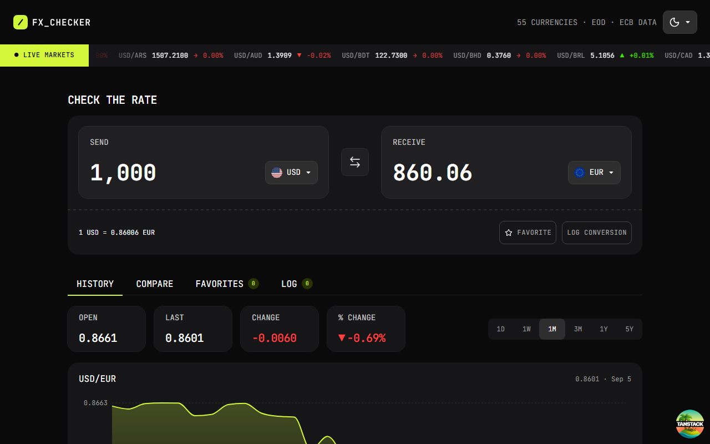
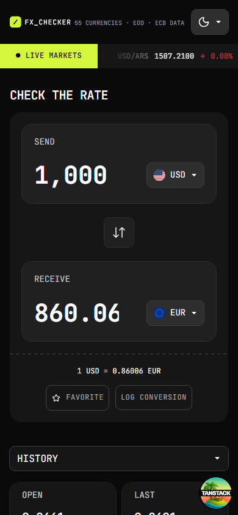

# FX Checker

An exchange-rate workspace for checking live currency conversions, comparing market movement, exploring historical rates, and keeping useful pairs close at hand.

**[Open the live app](https://fx-exchg-checker-app.vercel.app/)** · **[View the source on GitHub](https://github.com/pritamtirpude/fx-checker-app)**

## Screenshots

### Desktop



### Mobile



## What It Does

- Convert an amount between supported currencies with live rates.
- Browse a scrolling live-rate ticker with daily change indicators.
- Review historical rates for periods from one day to five years.
- Compare multiple currencies against the selected base currency.
- Save favorite currency pairs for quick access.
- Keep a local conversion log and clear it when needed.
- Switch between light and dark themes.
- Use the responsive layout on desktop and mobile screens.

Rates are provided by the [Frankfurter API](https://www.frankfurter.app/), with supported currencies filtered through the app's currency and flag mapping.

## Tech Stack

| Area         | Tools                                                                          |
| ------------ | ------------------------------------------------------------------------------ |
| Framework    | React 19, TanStack Start, Nitro                                                |
| Routing      | TanStack Router with file-based routes and typed search params                 |
| Server state | TanStack Query with SSR prefetching and hydration                              |
| Client state | Zustand for selected currency objects, amount, period, favorites, and log data |
| Charts       | Recharts for historical exchange-rate visualizations                           |
| Styling      | Tailwind CSS v4 with CSS-first design tokens                                   |
| Motion       | Motion for animated tab indicators and Motion Plus for the live ticker         |
| Utilities    | date-fns, clsx, tailwind-merge, lucide-react, react-number-format              |
| Tooling      | Vite, TypeScript, ESLint, Prettier, Vitest, Testing Library, Playwright        |

## Architecture

The app keeps URL state and UI state deliberately separate:

- `base` and `quote` live in the URL, making currency pairs shareable and preserving them across navigation.
- Zustand stores the richer currency objects needed by dropdowns, plus the amount and selected chart period.
- TanStack Router loaders prefetch all data required by the page before rendering.
- TanStack Query owns caching, deduplication, stale data, and request lifecycle state.
- TanStack Start server functions keep Frankfurter requests on the server boundary.

When a currency is selected, the reusable dropdown updates both the Zustand store and the URL. This keeps the visible selection, route loader, and query keys synchronized.

## Reusable Components

The UI is organized around focused components rather than one large page:

- `CheckRate` handles the main conversion workflow, swapping, amount input, and pair selection.
- `CurrencyDropdown` provides searchable currency selection with flags and URL synchronization.
- `RateCard` presents a reusable live-rate summary with change information.
- `HistoryChart` renders historical data with Recharts.
- `HistoryPeriodTabs` controls the chart range without coupling chart logic to the page.
- `Tabs` provides the shared history, compare, favorites, and log workspace navigation.
- `LiveTicker` uses Motion Plus to animate current market data across the header.
- `ThemeProvider` and `ThemeDropdown` manage persisted light and dark themes without a flash during hydration.
- `ClearLogModal` isolates the destructive confirmation flow from log rendering.

## Project Structure

```text
fx-checker-app/
├── public/
│   ├── assets/
│   │   ├── fonts/                 # JetBrains Mono font files
│   │   ├── images/flags/          # Currency flag assets
│   │   └── images/screenshots/    # README preview images
│   ├── manifest.json
│   ├── robots.txt
│   ├── sitemap.xml
│   └── sw.js
├── src/
│   ├── api/                       # Server functions and query option factories
│   │   ├── currencies.ts
│   │   ├── historyrates.ts
│   │   ├── liverates.ts
│   │   └── singlecurrency.ts
│   ├── components/                # Reusable application UI
│   ├── config/                    # Site-level configuration
│   ├── context/                   # Theme context and providers
│   ├── hooks/                     # Shared React hooks
│   ├── integrations/              # TanStack Query provider and devtools
│   ├── routes/                    # File-based TanStack Router routes
│   │   ├── __root.tsx
│   │   └── index.tsx
│   ├── store/                     # Zustand stores
│   ├── types/                     # Shared TypeScript types
│   ├── utils/                     # Currency mapping and helper functions
│   ├── router.tsx
│   └── styles.css
├── package.json
├── tsconfig.json
├── vite.config.ts
└── README.md
```

`src/routeTree.gen.ts` is generated by TanStack Router and should not be edited manually.

## Data Flow

```text
User selects a pair
        ↓
URL search params + Zustand store
        ↓
TanStack Router loader dependencies
        ↓
TanStack Query option factories
        ↓
TanStack Start server functions
        ↓
Frankfurter API
        ↓
Cached rates, cards, ticker, and Recharts history view
```

The route loader prefetches currencies, live rates, yesterday's rates, the selected conversion, and the selected historical series in parallel. Live rates refresh every 60 seconds, while historical and reference data remain cached according to their query options.

## Getting Started

### Requirements

- Node.js 22 or newer
- npm
- A `BASE_URL` environment variable pointing to the Frankfurter API, for example:

```env
BASE_URL=https://api.frankfurter.dev/v2
```

### Install and run

```bash
npm install
npm run dev
```

Open [http://localhost:3000](http://localhost:3000) in your browser.

## Available Scripts

```bash
npm run dev              # Start the Vite development server
npm run build            # Build the TanStack Start application
npm run preview          # Preview the production build
npm run generate-routes  # Regenerate the TanStack Router route tree
npm run lint             # Run ESLint
npm run format           # Format files and apply ESLint fixes
npm run check            # Check Prettier formatting
npm run test             # Run Vitest
```

## Deployment

The app is deployed on Vercel and uses Nitro as its runtime adapter. The production build can also target other Node-compatible Nitro presets.

```bash
npm run build
```

Live deployment: [fx-exchg-checker-app.vercel.app](https://fx-exchg-checker-app.vercel.app/)

## Design Notes

- JetBrains Mono gives the interface a precise, instrument-panel feel suited to numeric data.
- CSS custom properties define the FX neutral, lime, green, and red design tokens in one place.
- The same semantic Tailwind classes are remapped for light mode, keeping components theme-aware without duplicating their styles.
- Responsive tabs, compact cards, and mobile-specific navigation keep the main conversion flow usable at smaller widths.

## License

This project is a personal portfolio application. See the repository for the current licensing terms.
